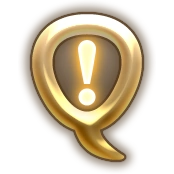

# FFXIV Quest Tracker

</img>

 

[repo]: https://github.com/razephalanx/FFXIV-Quest-Tracker
[latestRelease]: https://github.com/razephalanx/FFXIV-Quest-Tracker/releases/latest

FFXIV Quest Tracker is a simple program that lets the user see a full list of quests in FFXIV,
mark quests as complete (and mark them incomplete again), and save the list of completed quests to a local file.

The full list of quests is read from another .txt file stored in the same directory as the executable
and can be modified to include new quests or custom quests/categories for quests.

By default, the program reads and writes files to and from the same folder the executable is in,
but the user can specify where to read the main quest list from and where to save the checklist data.
The user can also specify what quests should be displayed by the program on startup. Currently the
"Theme" option is non-functional, but is intended to be properly added soon.

## :exclamation: Requirements
* .NET 6.0 or later

## :ballot_box_with_check: Features
* Local storage of all data
* Simple and lightweight
* Portable (no install required)
* Can save and read from multiple different lists of completed quests
* Can read [custom quest lists](#making-custom-quest-listsupdating-existing-quest-lists)

## :triangular_flag_on_post: Getting Started
Place the executable and the main quest list text file from the [latest release][latestRelease] in the
same directory and run the executable.
If you want to use an existing data file that already has a list of completed quests in it, you
can accomplish this in one of two ways:  
* **Option 1**: Use the Preferences tab
	1) Go to the "Preferences" tab
 	2) Change the "Default Save Location"
	3) Click "Save Preferences"
	4) Restart the Program
* **Option 2**: Rename the file you wish to use to the name used by the default data file ("FFXIVQT_data.txt")

## :grey_question: Using the Program
### :white_medium_square: Reading the Table
The program displays a table of quests with 5 columns:
* :heavy_check_mark: - Displays whether or not the quest is marked as "complete"
* :hash: - Displays the number of the quest as listed in the main quest list file
* **Title** - Displays the title of the quest
* **Level** - Displays the level of the quest
* **Area** - Displays the area the quest start is located in
* **GTD** - Displays a clickable link to the Garland Tools Data page for the quest or a custom URL

### :white_medium_square: Completing Quests
The program displays all quests available from the main quest list file. To mark a quest as completed,
simply click the check box on the row of the quest you want to mark complete.  
* Clicking "Save" will save the current list of completed quests to the default save file (path is displayed in
* Preferences).
* Clicking "Save As" will give the user a save file dialog window to select where to save the current list of
* completed quests.

If the user makes a change to the list of completed quests and tries to exit the program without saving,
the program will prompt the user to save their changes to the default save location before closing.

### :white_medium_square: Making Custom Quest Lists/Updating Existing Quest Lists
FFXIV Quest Tracker can read any checklist as a "quest list" and generate a category and sub-category for
them in the quest table as well as add them to the selection of default categories in Preferences. Users can
point the program to a .txt file and have it automatically populate the appropriate fields so long as the
file follows the appropriate formatting style:
* Main categories: "### maincategoryname ###"
    * Example: "### A Realm Reborn ###" is a main category called "A Realm Reborn".
* Sub-categories: "=== subcategory name ==="
    * Example: "=== Main Story Quest (2.0) ===" is a sub-category called "Main Story Quest (2.0)" that belongs to
	whichever main category is listed above it in the quest list file.
* Quests/Objectives: "Number	Title	Level	Area	URL/Garland Tools Data quest ID number"
    * **NOTE:** Each item in a quest has a **tab** in between them, **NOT** a space nor multiple spaces
	* Example: "1	Close to Home	Ul'dah - Steps of Nald	66104"
    	* Quest #1 in the subcategory listed above it in the quest list file
		* Title is "Close to Home"
		* Level is 1
		* Area issuer is in is "Ul'day - Steps of Nald"
		* ID number is "66104"
    		* Table displays "https://www.garlandtools.org/db/#quest/66104"
			* More about using URLs in the table [here](#about-urls-in-the-table)
	* The "URL/Garland Tools Data quest ID number" field can contain a URL to any page that a user desires.
	For example, if the user wants the displayed URL to be "https://www.google.com" then that can be typed as-is
	and the program will correctly display it and link to "https://www.google.com".
* Last line in file: "### EOF ###"
    * This line should be included to ensure that the program knows when to stop reading the quest
	  list file. Anything after this line will not be read.

Existing quest lists can be updated by adding to existing files using the proper formatting style.
This eliminates the need to update the program whenever new quests are added. Completed quest data
files can add new quests that are marked as completed automatically, but if new categories or
sub-categories are added then the ordering may become less human-readable. **There is no set order
for categories or sub-categories, so newly-added ones are simply added to the bottom of their
corresponding list**.

The file containing the list of completed quests is formatted in the same way, and users can create
custom lists of completed quests in the same way as creating custom quest lists.

---
#### :white_small_square: About URLs in the Table
FFXIV Quest Tracker reads the "URL" field in the quest list/data files in 1 of 3 ways:

1. URL is a quest ID number from Garland Tools Data and gets autocompleted to be a link to the
   corresponding page
   * The "ID number" for a quest on Garland Tools Data is the number at the end of the URL to its page
   (e.g., the ID number for the quest at "https://www.garlandtools.org/db/#quest/65644" is "65644")
2. URL is a custom URL beginning with "http://" or "https://" and is listed in the quest table as a
   clickable link to that page
3. URL is missing entirely and is auto-filled with a link to the Garland Tools Data page for quests

URLs added to the table are clickable links that open the user's default browser to the corresponding
web page.

---
#### :white_small_square: Sample Quest List File Contents
> \#\#\# A Realm Reborn \#\#\#  
  === Main Story Quest (2.0) ===  
  1	Close to home	1	Ul'dah - Steps of Nald	66104  
  2	Close to home	1	Limsa Lominsa Upper Decks	https://www.garlandtools.org/db/#quest/65644  
  3	Close to home	1	New Gridania	https://google.com  
  === Fake Sub-Category ===  
  1	Fake Quest	50	Fake Location	https://www.google.com  
  \#\#\# EOF \#\#\#
